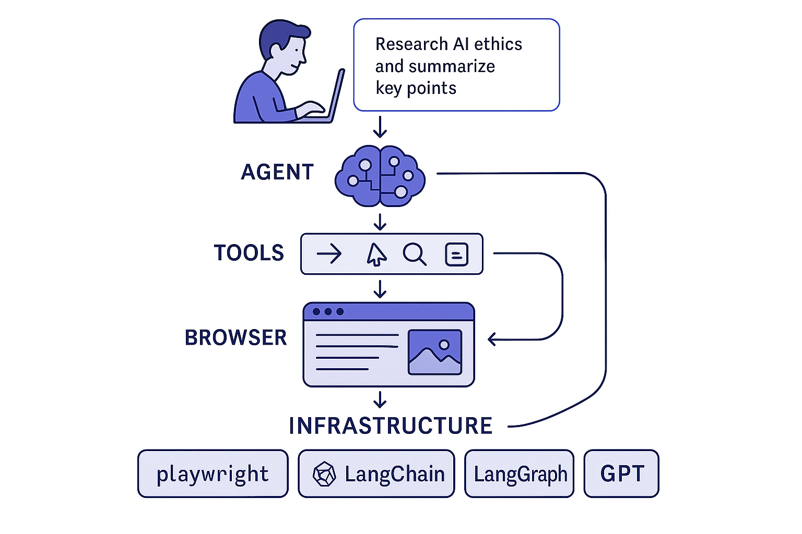

# 🌐 Browser Agent

[](https://github.com/yourusername/browser-agent)
[](https://www.python.org/downloads/)
[](LICENSE)

> **An AI-powered automation tool that controls web browsers through natural language commands**

<div align="center">
   <h2>AI Browser Navigation Demo</h2>
   <a href="https://www.youtube.com/watch?v=Xp3w5H4-pOw" target="_blank">
      
   </a>
   <p><em>Click the image above to watch the demo video</em></p>
</div>

## 📋 Table of Contents

- [Overview](#overview)
- [Features](#features)
- [Quick Start](#quick-start)
- [Installation](#installation)
- [Usage Examples](#usage-examples)
- [Configuration](#configuration)
- [Browser Agent Tools](#browser-agent-tools)
- [Architecture](#architecture)
- [Project Structure](#project-structure)
- [Technical Details](#technical-details)
- [Error Handling](#error-handling)
- [Advanced Usage](#advanced-usage)
- [Troubleshooting](#troubleshooting)
- [Use Cases](#use-cases)
- [Limitations](#limitations)
- [Roadmap](#roadmap)
- [Contributing](#contributing)
- [License](#license)

## 🔍 Overview

Browser Agent is a sophisticated Python application that enables users to control web browsers through natural language instructions. It uses a combination of AI models, browser automation, and DOM analysis to navigate websites, fill forms, click buttons, and perform complex web tasks based on natural language descriptions.

The agent features intelligent page analysis, robust error handling, and flexible interaction capabilities, making it ideal for automating repetitive browser tasks, web scraping, site testing, and interactive browsing sessions.

<details>
<summary><strong>Why use Browser Agent?</strong></summary>

- **Simplify Web Automation** - No more complex automation scripts or browser extensions
- **Reduce Learning Curve** - Use natural language instead of programming syntax
- **Improve Productivity** - Automate repetitive web tasks with minimal effort
- **Enhance Accessibility** - Enable browser control for users with limited technical knowledge
- **Rapid Prototyping** - Quickly test and iterate on web workflows
</details>

## ✨ Features

- **🗣️ Natural Language Control**: Control your browser with simple human language instructions
- **🔍 Intelligent Page Analysis**: Automatic detection and mapping of interactive elements on web pages
- **🧭 Context-Aware Navigation**: Smart navigation with history tracking and state awareness
- **📝 Form Handling**: Fill forms, select options from dropdowns, and submit data seamlessly
- **⚡ Dynamic Content Support**: Handle AJAX, infinite scrolling, popups, and dynamically loaded content
- **🔄 Error Recovery**: Robust error detection and recovery strategies
- **👤 User Interaction**: Request information from the user during task execution when needed
- **🌍 Multi-Browser Support**: Connect to existing Chrome browsers or launch new instances


## 🚀 Quick Start

### Prerequisites

- Python 3.11 or higher
- pip (Python package manager)
- Chrome browser (for existing browser connection)

### Step-by-Step Installation

1. **Clone the repository**

   ```bash
   git clone https://github.com/yourusername/browser-agent.git
   cd browser-agent
   ```

2. **Install Playwright browsers**

   ```bash
   playwright install
   ```

3. **Set up environment variables**

   Create a `.env` file in the project root:

   ```
   OPENAI_API_KEY=your_api_key_here
   AZURE_ENDPOINT=your_azure_endpoint  # If using Azure OpenAI
   ```

   Or set them directly in your terminal:

   ```bash
   export OPENAI_API_KEY=your_api_key_here
   export AZURE_ENDPOINT=your_azure_endpoint
   ```

4. **Run the Browser Agent**
   ```
   uv run main.py
   ```

## 🎮 Usage Examples

### Basic Commands

```bash
# Start a new browser session with the agent
uv run main.py run

# Launch with a specific task
uv run main.py run --task "Go to example.com and click the signup button"

# Run in headless mode (no visible browser window)
uv main.py run --headless

# Launch Chrome with remote debugging enabled
uv main.py launch --port 9222

# Run with verbose debug logging
uv main.py debug
```

### Interactive Examples

When the Browser Agent is running, you can provide natural language instructions of medium complexity that it will execute efficiently:

```
# Research and Summarize
Enter your instruction: Go to Wikipedia, search for "artificial intelligence ethics", find the main concerns section, and summarize the key points

# Online Shopping Assistant
uEnter your instruction: Search for a mid-range laptop on Amazon with at least 16GB RAM, sort by customer ratings, and tell me the top three options with their prices

# News Aggregation
Enter your instruction: Visit three major news sites, find articles about climate change from the past week, and create a summary of the main developments

# Recipe Finder
Enter your instruction: Find a chicken curry recipe that takes less than 30 minutes to prepare, has good reviews, and doesn't require specialty ingredients

# Product Comparison
Enter your instruction: Compare the features and prices of the latest iPhone and Samsung Galaxy models, focusing on camera quality and battery life

# Event Planning
Enter your instruction: Search for outdoor concerts in San Francisco next month, check the weather forecast for those dates, and recommend the best weekend to attend

# Job Search
Enter your instruction: Find software developer jobs in Boston that allow remote work, require Python experience, and were posted in the last week

# Email Writing
Enter your instruction: Write an email based on the extracted data or task completed. The email should be clear, professional, and suitable to send to a colleague or manager. Include a brief summary of what was done, any important findings, and next steps if applicable.

```

These examples show how Browser Agent can handle tasks that involve multiple steps across one or more websites, gathering specific information based on criteria, and providing summarized results.

## ⚙️ Configuration

### Environment Variables

Create a `.env` file with the following variables:

```
OPENAI_API_KEY=your_api_key_here
AZURE_ENDPOINT=your_azure_endpoint  # If using Azure OpenAI
```

### Browser Configuration

Configure browser settings in `configurations/config.py`:

```python
BROWSER_OPTIONS = {
    "headless": False,         # Run browser headlessly or with UI
    "slowmo": 0,               # Slow down actions by milliseconds (for debugging)
    "timeout": 30000,          # Default timeout in milliseconds
    "viewport": {              # Browser window size
        "width": 1280,
        "height": 800
    }
}

BROWSER_CONNECTION = {
    "use_existing": False,     # Connect to existing Chrome instance
    "cdp_endpoint": None,      # Custom CDP endpoint (e.g., "http://localhost:9222")
    "fallback_to_new": True,   # Fallback to launching new browser if connection fails
}
```

### Advanced Configuration Options

<details>
<summary><strong>Agent Configuration</strong></summary>

Modify `agent/agent.py` to configure the LLM settings:

```python
# LLM Model settings
llm = AzureChatOpenAI(
    model_name="gpt-4o",           # Model to use
    openai_api_key=api_key,        # API key
    temperature=0,                 # Deterministic output (0) to creative (1)
    api_version="2024-12-01-preview",
    azure_endpoint=os.getenv("AZURE_ENDPOINT"),
)
```

</details>

## 🛠️ Browser Agent Tools

The agent uses these specialized tools to control the browser:

| Tool                | Description                                                             | Example                                                          |
| ------------------- | ----------------------------------------------------------------------- | ---------------------------------------------------------------- |
| **analyze_page**    | Scans the DOM to create a map of all visible elements with numbered IDs | `analyze_page()`                                                 |
| **click**           | Clicks on elements using IDs from the page analysis                     | `click("[3][button]Submit")`                                     |
| **fill_input**      | Fills text into input fields                                            | `fill_input('{"id":"5","type":"input","value":"example text"}')` |
| **select_option**   | Selects options from dropdown menus                                     | `select_option('{"id":"8","value":"Option 2"}')`                 |
| **keyboard_action** | Sends keyboard shortcuts and special keys                               | `keyboard_action("Enter")`                                       |
| **navigate**        | Opens a URL in the browser                                              | `navigate("https://example.com")`                                |
| **go_back**         | Navigates to the previous page in browser history                       | `go_back()`                                                      |
| **scroll**          | Scrolls the viewport in specified directions                            | `scroll("down")`                                                 |
| **ask_user**        | Requests information from the user during task execution                | `ask_user('{"prompt":"Enter password","type":"password"}')`      |

### How Element References Work

When the agent analyzes a page, it assigns numeric IDs to each interactive element:

```
[1][button]Sign Up
[2][link]Learn More
[3][input]Search
```

The agent can then reference these elements by their ID, type, and text:

```
click("[1][button]Sign Up")
```

## 🏗️ Architecture

The Browser Agent is structured in a modular fashion:
<p align="center">
   
</p>

### Core Components

- **Agent Layer**: Manages AI interactions using LangChain and LangGraph
- **Browser Layer**: Controls web browsers via Playwright
- **CLI Layer**: Provides command-line interface and configuration
- **Tools Layer**: Implements specialized browser interaction capabilities

### Data Flow

1. User provides natural language instruction
2. Agent processes instruction and plans actions
3. Agent executes actions using browser tools
4. Browser interacts with web pages
5. Page analyzer extracts information from DOM
6. Agent interprets results and plans next actions
7. Agent provides results back to user

## 📂 Project Structure

```
browser_agent/
├── agent/
│   └── agent.py             # AI agent implementation
├── browser/
│   ├── analyzers/
│   │   └── page_analyzer.py # DOM analysis tools
│   ├── controllers/
│   │   ├── browser_controller.py  # Main browser interface
│   │   ├── element_controller.py  # Element interaction
│   │   └── keyboard_controller.py # Keyboard actions
│   ├── navigation/
│   │   ├── navigator.py      # URL and history navigation
│   │   └── scroll_manager.py # Scrolling capabilities
│   ├── utils/
│   │   ├── dom_helpers.py     # DOM manipulation helpers
│   │   ├── input_helpers.py   # Input processing utilities
│   │   └── user_interaction.py # User interaction tools
│   └── browser_setup.py      # Browser initialization
├── cli/
│   ├── chrome_launcher.py    # Chrome debugging launcher
│   └── commands.py           # CLI command definitions
├── configurations/
│   └── config.py             # Configuration settings
├── main.py                   # Application entry point
└── requirements.txt          # Dependencies
```

## 🔧 Technical Details

### AI Agent Framework

The Browser Agent is built on LangGraph, a stateful workflow framework for LLM applications. The agent uses a GPT model from Azure OpenAI with specialized tools for browser control.

<details>
<summary><strong>Agent Workflow</strong></summary>

1. **Instruction Processing**: The LLM parses the natural language instruction
2. **Tool Selection**: The agent decides which browser tools to use
3. **Action Execution**: The agent executes actions sequentially
4. **Progress Monitoring**: The agent tracks state changes and adapts
5. **Result Generation**: The agent compiles results for the user
</details>

### Browser Automation

The system uses Playwright for browser automation, providing cross-browser compatibility and powerful DOM manipulation capabilities.

### Element Detection

The Page Analyzer uses advanced JavaScript to scan the DOM and identify interactive elements, creating a numbered map of elements that the agent can reference with precise IDs.

## 🚨 Error Handling

The Browser Agent employs sophisticated error handling:

- **Element Detection**: Re-analysis after scrolling or waiting for dynamic content
- **Click Failures**: Alternative selection strategies and visibility checks
- **Navigation Issues**: Error detection and recovery for failed navigations
- **Form Validation**: Reading and addressing validation errors
- **Session Management**: Detection and handling of timeouts and authentication issues

## 🔍 Advanced Usage

### Connecting to Existing Chrome Instances

You can connect the Browser Agent to an already running Chrome instance:

1. Launch Chrome with remote debugging enabled:

   ```bash
   python main.py launch --port 9222
   ```

2. Configure the Browser Agent to use the existing instance:

   ```python
   # In configurations/config.py
   BROWSER_CONNECTION = {
       "use_existing": True,
       "cdp_endpoint": "http://localhost:9222",
   }
   ```

3. Run the Browser Agent:
   ```bash
   python main.py run
   ```

### Creating Multi-Step Automated Workflows

You can chain multiple instructions into a single workflow:

```bash
python main.py run --task "Go to gmail.com, wait for the login page,
enter the username 'test@example.com', click next, wait for the password field,
ask me for the password, enter it, and click sign in"
```

### User Interaction During Execution

The agent can prompt for user input during execution:

```python
# Example of how the agent uses the ask_user tool
ask_user('{"prompt":"Please enter your 2FA code","type":"text"}')
```

## 🔍 Troubleshooting

<details>
<summary><strong>Browser Connection Issues</strong></summary>

**Problem**: Unable to connect to Chrome with debugging enabled

**Solutions**:

1. Ensure Chrome is not already running with the same debugging port
2. Try a different port: `python main.py launch --port 9223`
3. Check firewall settings that might block the connection
4. Verify Chrome is installed in the default location or set the path manually
</details>

<details>
<summary><strong>Page Analysis Problems</strong></summary>

**Problem**: Agent can't find or interact with elements on the page

**Solutions**:

1. Give the page more time to load completely before analyzing
2. For dynamic content, ask the agent to scroll and re-analyze
3. Make your element references more specific
4. For highly dynamic sites, try slowing down agent actions with the `slowmo` option
</details>

<details>
<summary><strong>Authentication Challenges</strong></summary>

**Problem**: Agent can't handle login procedures with CAPTCHA or 2FA

**Solutions**:

1. Pre-authenticate in the browser before connecting the agent
2. Use the `ask_user` tool to get manual input for verification challenges
3. Consider using cookies or saved sessions for sites you access frequently
</details>

## 💼 Use Cases

- **Web Automation**: Automate repetitive web tasks with natural language instructions

  ```
  Fill out the same form on 20 different websites with my business information
  ```

- **Site Testing**: Test web applications with natural language test cases

  ```
  Visit our app, try to create a new account, and report any errors
  ```

- **Data Collection**: Extract information from websites

  ```
  Go to the weather website and collect the 5-day forecast for New York, Chicago, and Los Angeles
  ```

- **Interactive Assistance**: Guide users through complex web processes

  ```
  Help me book a flight from New York to San Francisco for next Friday, returning Sunday
  ```

- **Prototyping**: Quickly test web workflows without writing code
  ```
  Try our new checkout process with different payment methods and report the experience
  ```

## ⚠️ Limitations

- Cannot handle CAPTCHA or authentication challenges requiring human verification
- May face challenges with highly dynamic web apps that change rapidly
- Not designed for high-security operations (banking, etc.)
- Performance depends on the complexity of the website and instructions
- Cannot interact with elements that require hover actions only (without clickable alternatives)
- May struggle with websites that heavily use canvas or WebGL for rendering

## 🛣️ Roadmap

- **Multi-session Support**: Run multiple browser sessions simultaneously
- **Screenshot Capabilities**: Capture and analyze visual elements
- **PDF Processing**: Extract information from PDFs displayed in browsers
- **Enhanced Error Recovery**: More sophisticated recovery strategies
- **User Interface**: Add a web-based UI for easier interaction
- **Action Recording**: Record and replay browser sessions
- **Customizable Agents**: User-defined agent personalities and capabilities

## 🤝 Contributing

Contributions are welcome! Please feel free to submit a Pull Request.

1. Fork the repository
2. Create your feature branch (`git checkout -b feature/amazing-feature`)
3. Commit your changes (`git commit -m 'Add some amazing feature'`)
4. Push to the branch (`git push origin feature/amazing-feature`)
5. Open a Pull Request

## 📄 License

This project is licensed under the MIT License - see the [LICENSE](LICENSE) file for details.

---

<p align="center">
  Made with ❤️ by rkvalandasu
</p>
